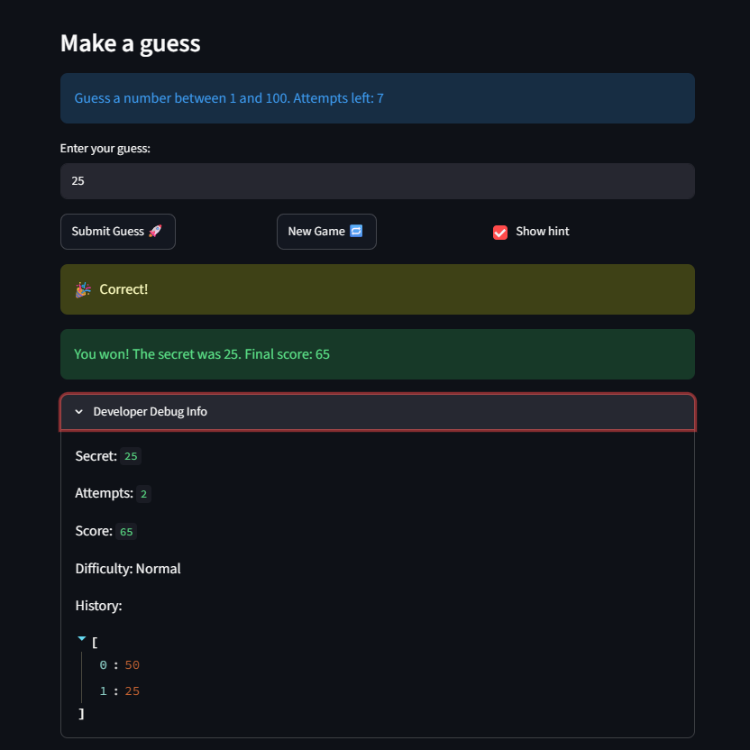
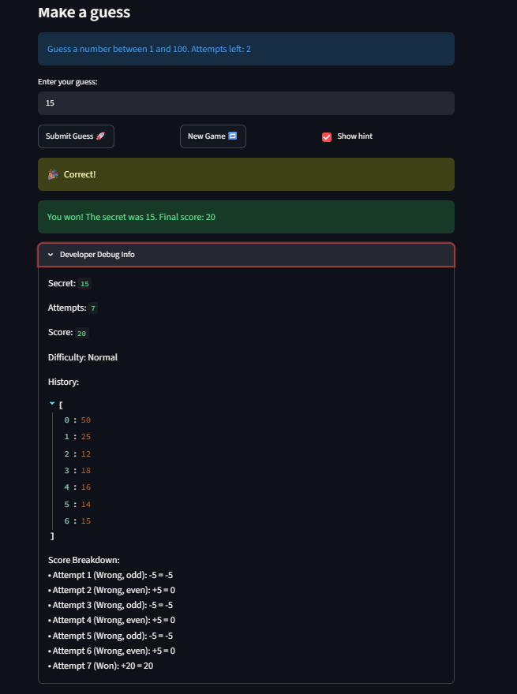

# 🎮 Game Glitch Investigator: The Impossible Guesser

## 🚨 The Situation

You asked an AI to build a simple "Number Guessing Game" using Streamlit.
It wrote the code, ran away, and now the game is unplayable. 

- You can't win.
- The hints lie to you.
- The secret number seems to have commitment issues.

## 🛠️ Setup

1. Install dependencies: `pip install -r requirements.txt`
2. Run the broken app: `python -m streamlit run app.py`

## 🕵️‍♂️ Your Mission

1. **Play the game.** Open the "Developer Debug Info" tab in the app to see the secret number. Try to win.
2. **Find the State Bug.** Why does the secret number change every time you click "Submit"? Ask ChatGPT: *"How do I keep a variable from resetting in Streamlit when I click a button?"*
3. **Fix the Logic.** The hints ("Higher/Lower") are wrong. Fix them.
4. **Refactor & Test.** - Move the logic into `logic_utils.py`.
   - Run `pytest` in your terminal.
   - Keep fixing until all tests pass!

## 📝 Document Your Experience

- [ ] Describe the game's purpose.
- [ ] Detail which bugs you found.
- [ ] Explain what fixes you applied.

## 📸 Demo Walkthrough

Describe your fixed game in numbered steps so a reader can follow along without watching a video:
-- Attempt 1 ---
1. User enters 25 
2. Game returns "Go Higher!"
3. User enters 50
4. Game returns "Go Higher!"
5. User enters 75
6. Game returns "Go Lower!"
7. User enters 65
8. Game returns "Go Lower!"
9. User enters 55
10. Game returns "Go Lower!"
11. User enters 53
12. Game returns "Go lower!"
13. User enters 51
14. Game returns "Go Higher"
15. User enters 52
16. Correct! Final score was: -5 

-- Found a bug with scoring ---
-- Reruning to replicate the error and find a fix --
1. 50
higher 
2. 75
higher
3. 95
lower
4. 85
lower
5. 80
higher
6. 83
correct

```
--- Idetified the bug: The developer bug info was displaying stale data because it was rendered at the top of the page before the game logic executed. This brought about showing the score and attempts from the previous action instead of the current one. ---
```

--- Attempt after fixing the bug and running tests to validate the state of the game ---
1. 50
go lower
2. 25
correct, final score: 65

--- Introduced a new feature in Developer Debug info to show score explanations ---
1. 50
go lower
2. 25
go lower
3. 12
go higher
4. 18
go lower
5. 16
go lower
6. 14
go higher
7. 15
correct, final score: 20 (and it matches the developer bug info explanations)

**Screenshot** *(optional)*: <!-- Insert a screenshot of your fixed, winning game here -->


**Screnshot (2)**:

## 🧪 Test Results

```
# Paste your pytest output here, e.g.:
# pytest tests/
(.venv) PS C:\..\CodePath\AI-110\ai110-module1show-gameglitchinvestigator-starter> pytest tests/test_game_logic.py -v
====================================================================== test session starts =======================================================================
platform win32 -- Python 3.13.5, pytest-9.1.1, pluggy-1.6.0 -- C:\...\CodePath\AI-110\ai110-module1show-gameglitchinvestigator-starter\.venv\Scripts\python.exe
cachedir: .pytest_cache
rootdir: C:\...\CodePath\AI-110\ai110-module1show-gameglitchinvestigator-starter
plugins: anyio-4.14.1
collected 32 items                                                                                                                                                

tests/test_game_logic.py::TestCheckGuessOutcomes::test_winning_guess PASSED                                                                                 [  3%]
tests/test_game_logic.py::TestCheckGuessOutcomes::test_guess_too_high_outcome PASSED                                                                        [  6%]
tests/test_game_logic.py::TestCheckGuessOutcomes::test_guess_too_low_outcome PASSED                                                                         [  9%]
tests/test_game_logic.py::TestHighLowMessageBug::test_too_high_message_says_go_lower PASSED                                                                 [ 12%]
tests/test_game_logic.py::TestHighLowMessageBug::test_too_low_message_says_go_higher PASSED                                                                 [ 15%]
tests/test_game_logic.py::TestHighLowMessageBug::test_correct_message_is_correct PASSED                                                                     [ 18%]
tests/test_game_logic.py::TestStringConversionBug::test_numeric_comparison_with_integers PASSED                                                             [ 21%]
tests/test_game_logic.py::TestStringConversionBug::test_numeric_comparison_consistency PASSED                                                               [ 25%]
tests/test_game_logic.py::TestStringConversionBug::test_numeric_comparison_low_consistency PASSED                                                           [ 28%]
tests/test_game_logic.py::TestStringConversionBug::test_no_string_conversion_large_numbers PASSED                                                           [ 31%]
tests/test_game_logic.py::TestParseGuessValidation::test_parse_valid_integer PASSED                                                                         [ 34%]
tests/test_game_logic.py::TestParseGuessValidation::test_parse_float_as_integer PASSED                                                                      [ 37%]
tests/test_game_logic.py::TestParseGuessValidation::test_parse_none_input PASSED                                                                            [ 40%]
tests/test_game_logic.py::TestParseGuessValidation::test_parse_empty_string PASSED                                                                          [ 43%]
tests/test_game_logic.py::TestParseGuessValidation::test_parse_non_numeric_input PASSED                                                                     [ 46%]
tests/test_game_logic.py::TestParseGuessValidation::test_parse_negative_number PASSED                                                                       [ 50%]
tests/test_game_logic.py::TestParseGuessValidation::test_parse_zero PASSED                                                                                  [ 53%]
tests/test_game_logic.py::TestGetRangeForDifficulty::test_easy_range PASSED                                                                                 [ 56%]
tests/test_game_logic.py::TestGetRangeForDifficulty::test_normal_range PASSED                                                                               [ 59%]
tests/test_game_logic.py::TestGetRangeForDifficulty::test_hard_range PASSED                                                                                 [ 62%]
tests/test_game_logic.py::TestGetRangeForDifficulty::test_unknown_difficulty_defaults_to_normal PASSED                                                      [ 65%]
tests/test_game_logic.py::TestUpdateScore::test_winning_score_first_attempt PASSED                                                                          [ 68%]
tests/test_game_logic.py::TestUpdateScore::test_winning_score_second_attempt PASSED                                                                         [ 71%]
tests/test_game_logic.py::TestUpdateScore::test_winning_score_caps_at_10 PASSED                                                                             [ 75%]
tests/test_game_logic.py::TestUpdateScore::test_too_high_even_attempt_adds_points PASSED                                                                    [ 78%]
tests/test_game_logic.py::TestUpdateScore::test_too_high_odd_attempt_subtracts_points PASSED                                                                [ 81%]
tests/test_game_logic.py::TestUpdateScore::test_too_low_always_subtracts_points PASSED                                                                      [ 84%]
tests/test_game_logic.py::TestUpdateScore::test_score_accumulation PASSED                                                                                   [ 87%]
tests/test_game_logic.py::TestIntegration::test_full_game_flow_win PASSED                                                                                   [ 90%]
tests/test_game_logic.py::TestIntegration::test_score_accumulation_with_real_guesses PASSED                                                                 [ 93%]
tests/test_game_logic.py::TestDebugInfoAccuracy::test_win_score_displayed_correctly_after_multiple_wrong_guesses PASSED                                     [ 96%]
tests/test_game_logic.py::TestDebugInfoAccuracy::test_score_consistency_across_attempt_numbers PASSED                                                       [100%]

======================================================================= 32 passed in 0.20s =======================================================================
```

## 🚀 Stretch Features

- [ ] [If you choose to complete Challenge 4, describe the Enhanced UI changes here — a screenshot is optional]
